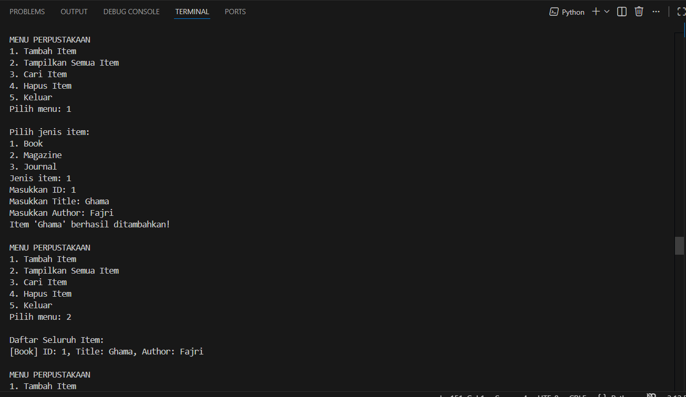

# Sistem Manajemen Perpustakaan Sederhana

Program ini merupakan implementasi konsep **Object-Oriented Programming (OOP)** pada Python 
untuk membuat sistem manajemen perpustakaan sederhana. Program dapat menambah item, menampilkan
daftar item, mencari item, serta menghapus item berdasarkan ID atau judul.

## 🔧 Fitur Utama
- Menambahkan item ke perpustakaan (Book, Magazine, Journal)
- Menampilkan daftar semua item
- Mencari item berdasarkan ID atau judul
- Menghapus item berdasarkan ID atau judul
- Sistem menu interaktif dengan perulangan
- Struktur OOP lengkap (abstract class, inheritance, polymorphism, encapsulation, property)

## 🧩 Konsep OOP yang Digunakan

### 1. Abstract Class
`LibraryItem` adalah abstract class yang menjadi basis semua item.  
Menggunakan `@abstractmethod` pada method `display_info()`.

### 2. Inheritance
Tiga subclass mewarisi `LibraryItem`:
- `Book`
- `Magazine`
- `Journal`

### 3. Encapsulation
- Atribut private: `__title`, `__items`
- Atribut protected: `_item_id`

### 4. Property
Atribut `title` menggunakan dekorator:
```python
@property
def title(self):
    return self.__title
```
## Diagram Class
```
            <<abstract>>
         ┌───────────────────┐
         │   LibraryItem     │
         ├───────────────────┤
         │ - _item_id        │
         │ - __title         │
         ├───────────────────┤
         │ + title           │
         │ + matches()       │
         │ + display_info()* │
         └─────────┬─────────┘
           ▲        ▲        ▲
 ┌─────────┘        │        └─────────┐
 │                  │                  │
 │                  │                  │
┌───────────┐  ┌───────────┐    ┌────────────┐
│   Book    │  │ Magazine  │    │  Journal   │
├───────────┤  ├───────────┤    ├────────────┤
│ + author  │  │ + issue   │    │ + volume   │
│           │  │           │    │ + year     │
├───────────┤  ├───────────┤    ├────────────┤
│ display_  │  │ display_  │    │ display_   │
│  info()   │  │  info()   │    │  info()    │
└───────────┘  └───────────┘    └────────────┘

┌─────────────────────────┐
│        Library          │
├─────────────────────────┤
│ - __items               │
├─────────────────────────┤
│ + add_item()            │
│ + display_all_items()   │
│ + search()              │
│ + delete_item()         │
└─────────────────────────┘
```

## Screenshot

